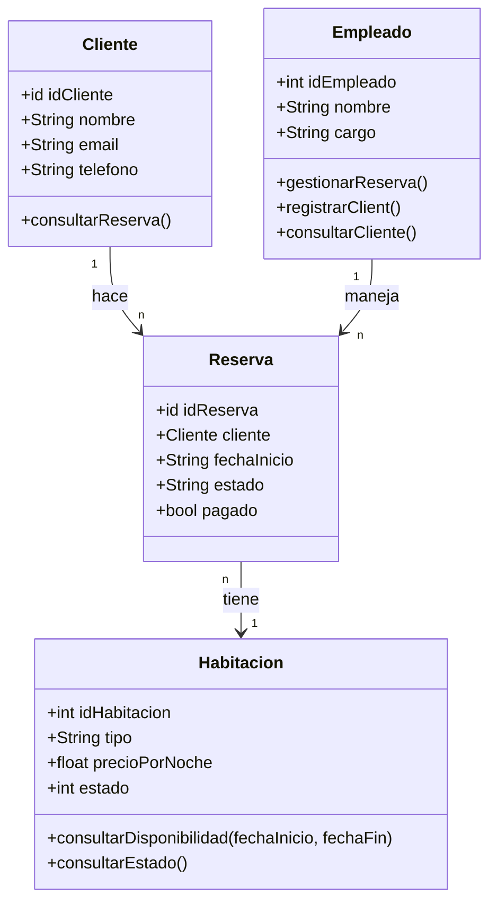
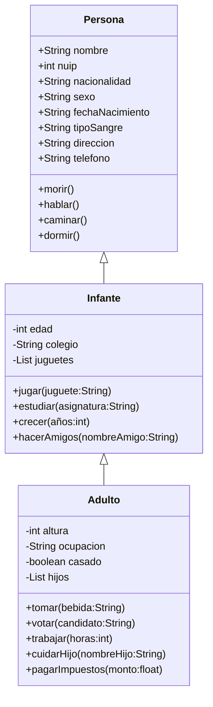

# poo-reto-2

## Ejemplo 1: Sistema de reservas de un hotel

```mermaid
classDiagram
    Cliente"1" --> "n" Reserva : hace
    Reserva"n" --> "1" Habitacion : tiene

    Empleado"1" --> "n" Reserva : maneja

    
    class Habitacion {
      +int idHabitacion
      +String tipo
      +float precioPorNoche
      +int estado
      
      +consultarDisponibilidad(fechaInicio, fechaFin)
      +consultarEstado()
    }

    class Empleado {
      +int idEmpleado
      +String nombre
      +String cargo
      
      +gestionarReserva()
      +registrarClient()
      +consultarCliente()
    }

    class Reserva {
      +id idReserva
      +Cliente cliente
      +String fechaInicio
      +String estado
      +bool pagado
    }


    class Cliente {
      +id idCliente
      +String nombre
      +String email
      +String telefono

      +consultarReserva()
    }
```

## Ejemplo 2: Persona

```mermaid
classDiagram
    Persona <|-- Infante
    Infante <|-- Adulto    

    Persona : +String nombre
    Persona : +int nuip
    Persona : +String nacionalidad
    Persona : +String sexo
    Persona : +String fechaNacimiento
    Persona : +String tipoSangre
    Persona : +String direccion
    Persona : +String telefono
    
    Persona : +morir()
    Persona : +hablar()
    Persona : +caminar()
    Persona : +dormir()

    class Infante {
        -int edad
        -String colegio
        -List juguetes

        +jugar(juguete:String)
        +estudiar(asignatura:String)
        +crecer(años:int)
        +hacerAmigos(nombreAmigo:String)
    }

    class Adulto {
        -int altura
        -String ocupacion
        -boolean casado
        -List hijos

        +tomar(bebida:String)
        +votar(candidato:String)
        +trabajar(horas:int)
        +cuidarHijo(nombreHijo:String)
        +pagarImpuestos(monto:float)
    }
```
