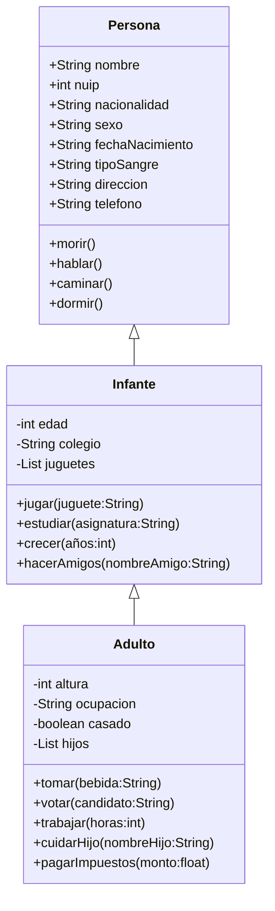

# poo-reto-2

```mermaid
classDiagram
    Persona <|-- Infante
    Infante <|-- Adulto    

    Persona : +String nombre
    Persona : +int nuip
    Persona : +String nacionalidad
    Persona : +String sexo
    Persona : +String fechaNacimiento
    Persona : +String tipoSangre
    Persona : +String direccion
    Persona : +String telefono
    
    Persona : +morir()
    Persona : +hablar()
    Persona : +caminar()
    Persona : +dormir()

    class Infante {
        -int edad
        -String colegio
        -List juguetes

        +jugar(juguete:String)
        +estudiar(asignatura:String)
        +crecer(años:int)
        +hacerAmigos(nombreAmigo:String)
    }

    class Adulto {
        -int altura
        -String ocupacion
        -boolean casado
        -List hijos

        +tomar(bebida:String)
        +votar(candidato:String)
        +trabajar(horas:int)
        +cuidarHijo(nombreHijo:String)
        +pagarImpuestos(monto:float)
    }

```
